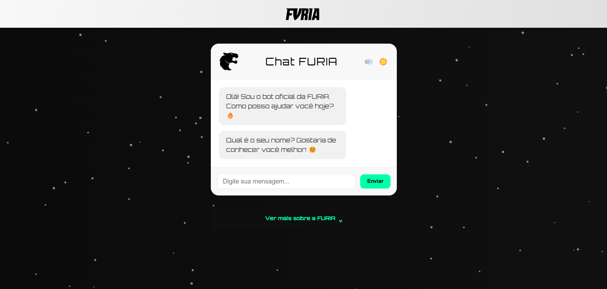

# Chatbot para Furiagg

Este é um chatbot desenvolvido para a Furiagg, uma empresa de E-sports. O projeto foi criado utilizando **HTML**, **CSS** e **JavaScript**, com foco em design responsivo e uma experiência de usuário interativa.

## Funcionalidades
- **Dashboard principal:** Interface limpa e intuitiva para interação com o chatbot.
- **Tema claro e escuro:** Alternância de temas para melhor acessibilidade.
- **Aba "Ver Mais":** Exibe informações adicionais de forma organizada.
- **Conversas em tempo real:** Respostas rápidas e inteligentes gerenciadas por JavaScript.

## Estrutura do Projeto
O projeto está dividido em dois arquivos principais de JavaScript:
1. **`main.js`**: Gerencia as funcionalidades principais do chatbot, incluindo a interface e a interação geral.
2. **`chat.js`**: Responsável pela lógica das conversas do chatbot.

## Imagens do Projeto
- **Dashboard Principal (Tema Escuro):**


- **Dashboard Principal (Tema Claro):**


- **Aba "Ver Mais":**
.

## Como Rodar o Projeto
1. Clone este repositório:
   ```bash
   git clone https://github.com/allefe1/chat-bot-Furia/
